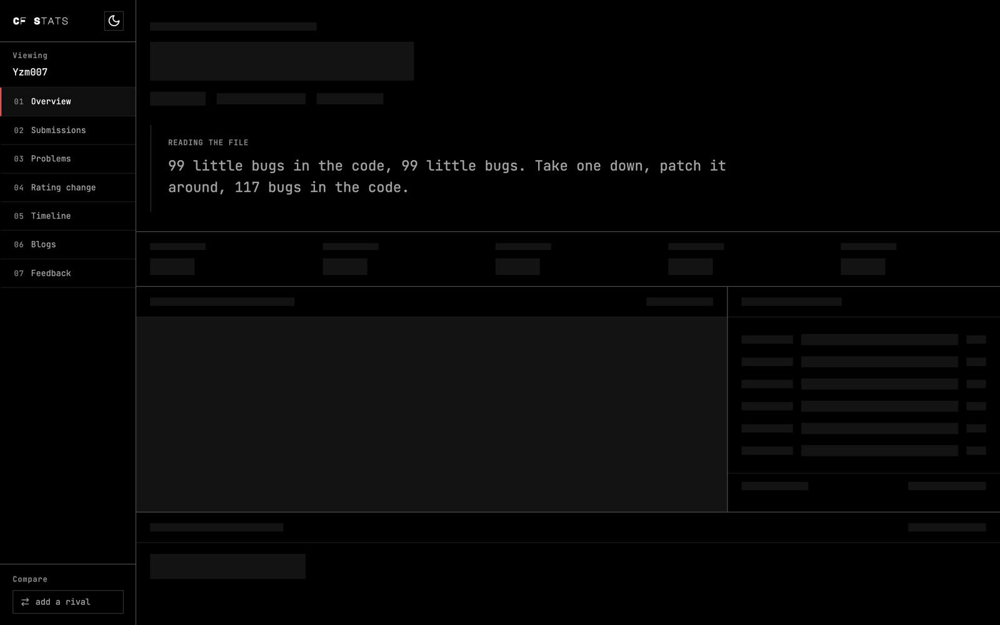
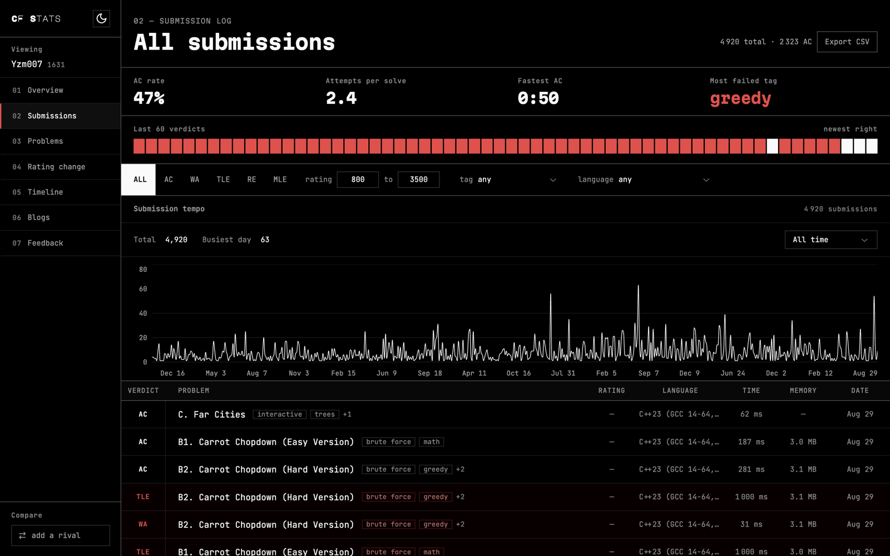
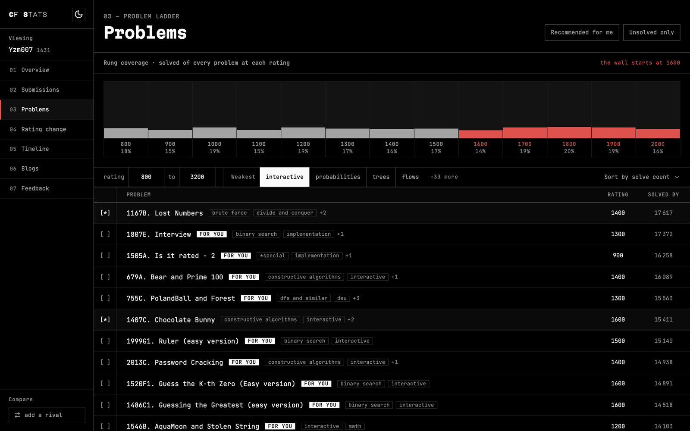
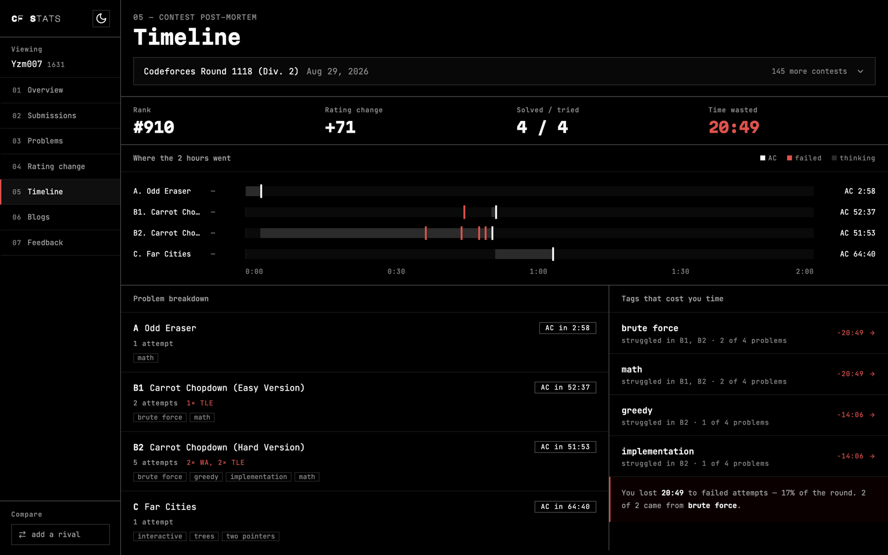
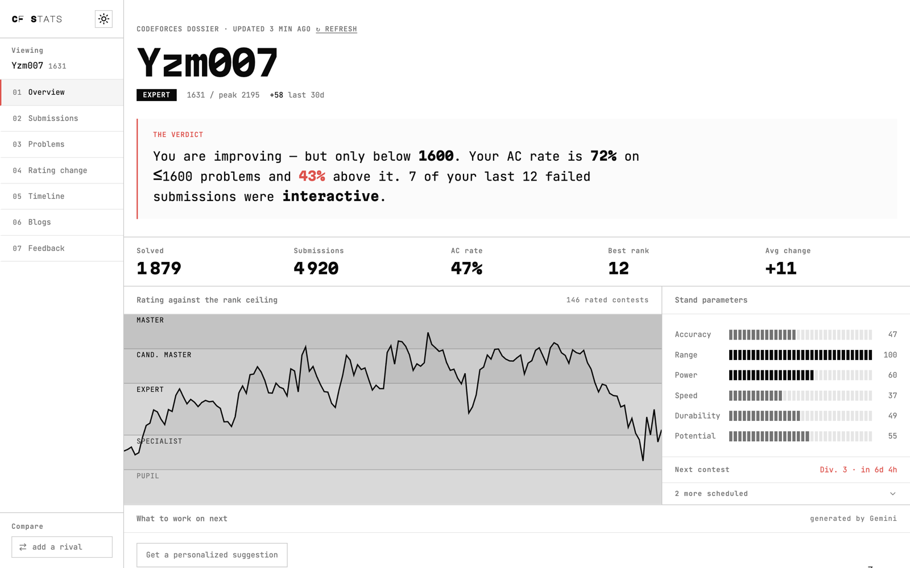

# Codeforces Visualizer

**[cfstats.vercel.app](https://cfstats.vercel.app/)**

A statistics dashboard for [Codeforces](https://codeforces.com). Type a handle and
it reads that account's public history from the Codeforces API and tells you how
you are doing — a rating graph against the rank bands, every submission by
verdict and tag, a problem ladder showing your coverage at each rating, and a
post-mortem of where any individual round went.

No account, no sign-up. Everything is read from the public Codeforces API in your
browser.



---

## What each screen does

`/` answers *"am I improving, and what do I do next?"*. The sub-routes answer
narrower versions of the same question.

| | Route | What it shows |
| --- | --- | --- |
| 01 | **Overview** | A plain-English verdict built from your real numbers, the rating curve against rank bands, and six skill meters |
| 02 | **Submissions** | Every submission, filtered by verdict, rating range, tag and language, with a tempo chart and the last 60 outcomes at a glance |
| 03 | **Problems** | Solved ÷ total at every 100-point band, and unsolved problems matching your weakest tags |
| 04 | **Rating change** | The rating curve with a per-contest delta row aligned beneath it, and every contest with its rank and change |
| 05 | **Timeline** | Where one round actually went: a gantt of attempts, time lost to failures, and the tags that cost you most |
| 06 | **Blogs** | Recent Codeforces blog entries and editorials |
| 07 | **Feedback** | Anonymous notes on what to fix |
| — | **Compare** | Your record against a rival: who finished ahead in every contest you both entered, how the gap moved, which tags they've solved and you haven't, and what to practise |

<details>
<summary>More screens</summary>







Light mode:



</details>

---

## Design

The UI follows a documented direction called **"Dossier"** — the profile reads
like a printed intelligence report. Four rules carry the whole system:

1. **Palette is black / white / red only.** Rank and difficulty are luminance
   steps, never hue. Red is reserved for failure and urgency.
2. **Radius is 0 everywhere.**
3. **Type comes from seven named steps.** Never ad-hoc pixel sizes.
4. **One left rail: 20px.** Every section on every route shares it.

**[`DESIGN.md`](DESIGN.md)** is the full spec — tokens, type scale, layout,
deliberate decisions, and the known gaps. Read it before changing anything
visual; it explains why several things that look like bugs are not.

---

## Stack


- **Next.js 14** (App Router) with **TypeScript**
- **Tailwind** with a custom token layer; a few **shadcn/ui** primitives
- **Recharts** for the rating and tempo charts
- **Zustand** for client state, with a read-through Cache API layer over the
  Codeforces endpoints (5 min profile, 1 h contests, 24 h problemset)
- **PostgreSQL** via **Prisma**, hosted on Neon
- **Gemini** for the optional "what to work on next" suggestion

### What touches the database

Almost nothing does. Everything you see is fetched in the browser.

| Table | Holds | Why |
| --- | --- | --- |
| `Snapshot` | One row per handle per day: rating, solved, AC rate, six skill scores, solves per tag | Codeforces has no endpoint for what your AC rate looked like three months ago — `user.rating` is a rating history and nothing else. All of it is public on that handle's own profile. |
| `DailyMetric` | Aggregate counters, one per name per day | Answers "how often does the product fail", not "what did this person do". No session id, no handle, no ordering. |
| `Feedback` | Anonymous notes | No handle, no IP, no user agent. |

---

## Running it locally

Requires **Node 24** and **pnpm**. Node 24 because `analytics.test.mjs` imports
a `.ts` file directly and relies on native type stripping; the app itself runs on
22+. Use pnpm — there is no `package-lock.json` and `npm install` would resolve a
different tree.

```bash
git clone https://github.com/Ryomensukuna2003/Codeforces-Visualizer.git
cd Codeforces-Visualizer
pnpm install
cp .env.example .env      # then fill it in — see below
pnpm exec prisma generate
pnpm dev
```

Open [http://localhost:3000](http://localhost:3000).

### Environment

Everything in `.env` is optional except the database, and the app degrades
rather than crashing when a key is missing — snapshots stop being recorded, the
AI suggestion returns an honest failure message.

| Variable | Needed for |
| --- | --- |
| `DATABASE_URL` | Everything Postgres-backed. The **pooled** Neon endpoint. |
| `DIRECT_URL` | `prisma migrate` only. The **same** endpoint without `-pooler`. |
| `GEMINI_API_KEY` | The "what to work on next" suggestion |
| `NEXT_PUBLIC_CLIST_API_KEY` | The unused clist.by proxy route |
| `NEXT_PUBLIC_SITE_URL` | Canonical URLs and share cards |

> `DATABASE_URL` and `DIRECT_URL` must point at the **same database**. Neon gives
> you two endpoints for one database — pooled and direct — and they differ only
> by a `-pooler` suffix. If they point at different databases, migrations land
> somewhere the app never reads, and you get tables that exist in one place and
> a 500 in the other. `.env.example` spells this out.

`pnpm build` runs `prisma migrate deploy` before building, so a deploy applies
migrations with its own credentials. **Don't run `pnpm build` in CI** — see
`.github/workflows/ci.yml`, which calls `next build` directly for that reason.

---

## Checks

There is no test framework. A handful of things carry enough logic to be worth
a runnable check, and each one lives beside the code it guards:

```bash
node src/lib/cn.test.mjs         # Tailwind class merging keeps the type scale
node src/lib/verdict.test.mjs    # the verdict never contradicts itself
node src/lib/analytics.test.mjs  # the public snapshot endpoint rejects junk
node src/lib/feedback.test.mjs   # feedback validation
node src/lib/compare.test.mjs    # head-to-head: ties, chronology, tag diffs
pnpm exec tsc --noEmit
```

CI runs all of these plus a build on every pull request.

---

## Contributing

Pull requests and issues welcome. Two things worth knowing first:

- **Read [`DESIGN.md`](DESIGN.md)** if the change is visual. §7 lists decisions
  that look like mistakes and are not.
- **Numbers shown to a user must be defensible.** The verdict on `/` asserts
  things about someone's practice; if you change a derivation, check the edge
  cases — no submissions, one contest, an unrated handle — and leave a check
  behind.
